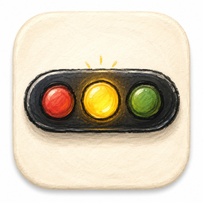

<p align="center">
  
</p>
<h1 align="center">AI Status Beacon</h1>
<p align="center">
  <a href="README.zh-CN.md">简体中文</a>
  ·
  <a href="README.ko-KR.md">한국어</a>
  ·
  <a href="README.ja-JP.md">日本語</a>
</p>
<p align="center">
  <a href="https://github.com/zhaolu83949426-hub/ai-status-beacon/releases"></a>
  
</p>

AI Status Beacon is a desktop status hub for AI coding agents. It keeps runtime state, permission requests, and quota snapshots in one lightweight utility window, so you can see what your agents are doing without staying in the terminal.

## Highlights

- Live status bar for agent execution state and attention signals
- Agent management page with per-agent monitoring, hook status, and permission takeover switches
- Desktop approval pop-ups for supported agents
- Quota account management with two status-bar display slots
- Sound alerts, auto-start, tray controls, and utility-style desktop experience
- GitHub Releases packaging for Windows and macOS

## Traffic Light Logic

- Single-light mode shows one color at a time, while triple-light mode uses separate red, yellow, and green lamps
- Green means everything is idle, resting, or already finished
- When a task finishes and the app returns to a calm state, the green light blinks a few times as a completion reminder
- Yellow means the agent is busy, thinking, waiting for your attention, or asking for confirmation
- Yellow keeps blinking when there is something you should notice right away, such as a permission request or an important prompt
- Red means something went wrong
- If several agent sessions are active at once, the status bar always shows the most important signal first

## Supported Agents

- Claude Code
- Codex CLI
- Gemini CLI
- Kimi CLI
- Qwen Code
- opencode
- CodeBuddy
- Qoder
- Antigravity CLI
- Cursor Agent
- Copilot CLI
- Kiro CLI
- Pi
- OpenClaw
- Hermes

## Supported Quota Providers

- GitHub Copilot
- Kimi
- Zhipu GLM
- MiniMax
- DeepSeek
- StepFun
- SiliconFlow
- OpenRouter
- Novita

## Releases

- Windows: NSIS installer for x64
- macOS: DMG packages for x64 and Apple Silicon
- Linux is not supported in this project

Download packaged builds from the [GitHub Releases](https://github.com/zhaolu83949426-hub/ai-status-beacon/releases) page.

## Development

```bash
npm ci
npm run dev
```

## Tech Stack

- Electron
- React
- TypeScript
- electron-builder
- electron-updater
